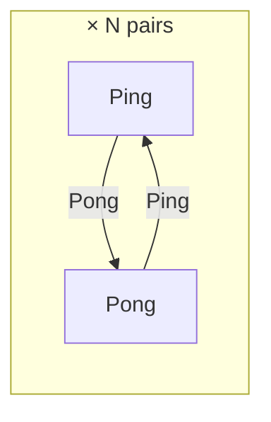
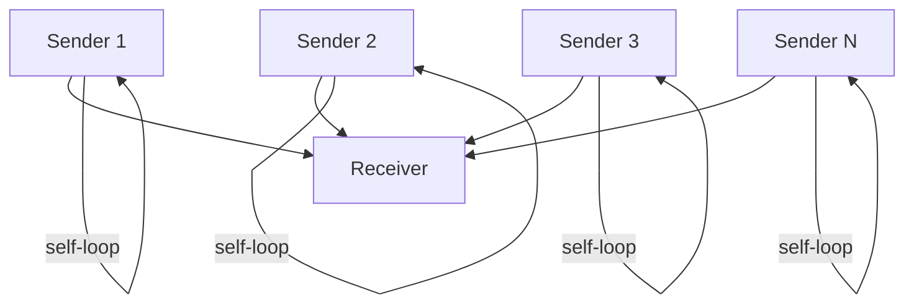
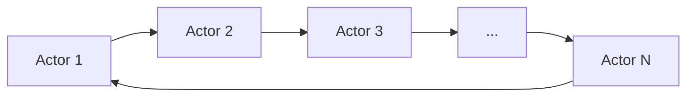
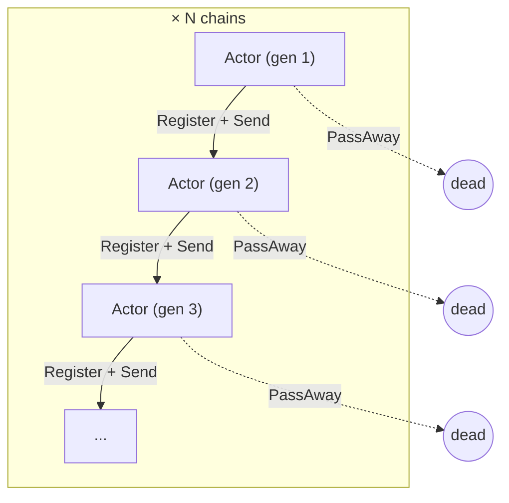

# WS System Benchmarks

A/B benchmark comparing the work-stealing executor pool (`ws`) against the
baseline shared-queue executor pool (`basic`) across four messaging topologies.

Source: `ydb/library/actors/core/workstealing/bench/system/system_bench.cpp`

## Building

```bash
./ya make -j32 ydb/library/actors/core/workstealing/bench/system
```

Binary:
`ydb/library/actors/core/workstealing/bench/system/ws_system_bench`

## CLI Reference

```
ws_system_bench [OPTIONS]
```

| Flag | Default | Description |
|------|---------|-------------|
| `--pool-type` | `both` | `basic`, `ws`, or `both` |
| `--scenario` | `all` | `ping-pong`, `star`, `chain`, `reincarnation`, or `all` |
| `--threads` | `1,2,4,8` | Comma-separated thread counts |
| `--pairs` | `10,100` | Comma-separated actor counts (pairs / senders / chain length) |
| `--duration` | `5` | Measurement seconds per scenario |
| `--warmup` | `1` | Warmup seconds before measurement (counters reset after) |
| `--spin-threshold` | `0` | WS spin threshold in CPU cycles (0 = default 100k) |
| `--min-spin-threshold` | `0` | WS min spin threshold in CPU cycles (0 = default 10k) |

### Output

CSV on stdout, one row per (pool_type, scenario, threads, pairs) combination:

```
pool_type,scenario,threads,actor_pairs,ops_per_sec,avg_latency_us,cpu_seconds,cpu_util_pct
```

For WS runs, a comment line is printed before each CSV row with internal
counters (exec, stolen, steal attempts, idle/busy polls, parks/wakes).

## Scenarios

All scenarios count events processed by actor `Receive` handlers. One
"operation" = one event delivered and processed. The four topologies stress
different aspects of the scheduler.

### 1. Ping-Pong

Symmetric point-to-point messaging. Tests raw scheduler throughput with
minimal contention on the activation queues.



**Setup:** N pairs of actors. Each pair exchanges Ping/Pong messages in a
tight loop. Every delivered event increments a shared counter.

**What it measures:**
- Per-event scheduling overhead (push + pop + execute)
- Cache locality of activation routing (same-slot affinity)
- Steal efficiency under balanced load (each pair is independent)

**Scaling:** Perfectly parallel — N pairs = N independent message streams.
With `--pairs 100 --threads 96`, each thread services ~1 pair on average.

### 2. Star (Fan-In)

Many-to-one messaging. Tests how the scheduler handles a single hot mailbox
receiving from many senders.



**Setup:** 1 receiver + N senders. Each sender sends a message to the
receiver, then sends a self-message to keep itself running. The receiver
just increments the counter.

**What it measures:**
- Contention on a single mailbox (all senders target the same actor)
- Mailbox lock throughput under fan-in pressure
- Queue fairness — whether the receiver gets enough CPU time

**Known characteristics:** The receiver's mailbox becomes a serialization
point. The `basic` pool handles this better because its shared queue
naturally funnels all activations to any available thread. WS per-slot
queues can leave the receiver pinned to one slot while other slots spin
idle, making this topology a known WS weakness.

### 3. Chain (Ring)

Sequential token-passing through a ring of actors. Tests cross-actor
scheduling latency with strict ordering.



**Setup:** N actors wired in a ring. A single token message circulates:
each actor receives it, increments the counter, and forwards to the next.

**What it measures:**
- Activation-to-execution latency (time between Send and Receive)
- Cross-slot routing overhead (sequential chain defeats locality)
- Wake-up efficiency (only one actor is runnable at any time)

**Known characteristics:** Only one message is in flight at a time, so
parallelism is 1 regardless of thread count. This scenario measures
scheduling latency, not throughput. WS benefits from slot affinity — if
consecutive chain actors land on the same slot, no cross-slot hop is
needed.

### 4. Reincarnation

Actor lifecycle stress test. Tests mailbox allocation, registration, and
garbage collection throughput.



**Setup:** N independent reincarnation chains. Each actor receives one
message, registers a successor actor, sends it a message, then dies
(`PassAway`). The successor repeats the cycle.

**What it measures:**
- `TMailboxTable::Allocate` / `Free` throughput under contention
- Actor registration cost (`Register` → mailbox lock → slot routing)
- Steal effectiveness for short-lived activations (each mailbox processes
  exactly one event before being freed)

**Known characteristics:** High mailbox churn — every event creates and
destroys a mailbox. The WS pool's slot-affine routing helps here: newly
registered actors often land on the same slot as their parent, reducing
cross-slot hops.

## Reading the WS Counter Lines

Each WS run prints a comment line before the CSV row:

```
# [ws/ping-pong t=96 p=100] exec=60806856 drained=0 stolen=23624694 steal_att=21979295 idle=114529781 busy=38353689 parks=280259 wakes=280257
```

| Counter | Meaning |
|---------|---------|
| `exec` | Total events executed across all slots |
| `drained` | Events executed during slot draining (deflation) |
| `stolen` | Total activations stolen from other slots |
| `steal_att` | Total steal attempts (includes misses) |
| `idle` | Idle `PollSlot` calls (no work found) |
| `busy` | Busy `PollSlot` calls (work executed) |
| `parks` | Thread park events (futex wait) |
| `wakes` | Thread wake events (futex wake) |

Key ratios to watch:
- **stolen / steal_att** — steal hit rate. Low ratio = lots of wasted probes.
- **parks / wakes** — should be roughly equal. Large parks with few wakes
  means threads are parking unnecessarily.
- **idle / busy** — high idle ratio means threads are spinning without work.
  Compare with `cpu_util_pct` to see if spin is consuming CPU.

## Interpreting Results

### What "ops_per_sec" means per scenario

| Scenario | One "op" |
|----------|----------|
| ping-pong | One Ping or Pong delivered and processed |
| star | One message delivered to the receiver |
| chain | One forward hop in the ring |
| reincarnation | One actor created, messaged, and destroyed |

### Typical performance profiles

| Scenario | WS strength | WS weakness |
|----------|-------------|-------------|
| ping-pong | Slot affinity keeps pairs local, avoids shared queue contention | — |
| star | — | Single hot receiver serializes on one slot; basic's shared queue distributes better |
| chain | Low latency from slot affinity for consecutive actors | Only 1 message in flight, can't exploit parallelism |
| reincarnation | Budget-aware stealing reduces churn; new actors inherit parent's slot | High mailbox alloc/free overhead is pool-independent |
