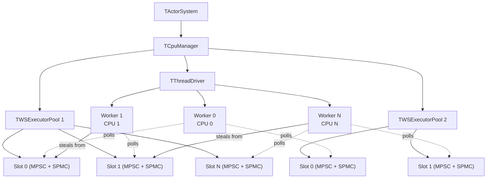
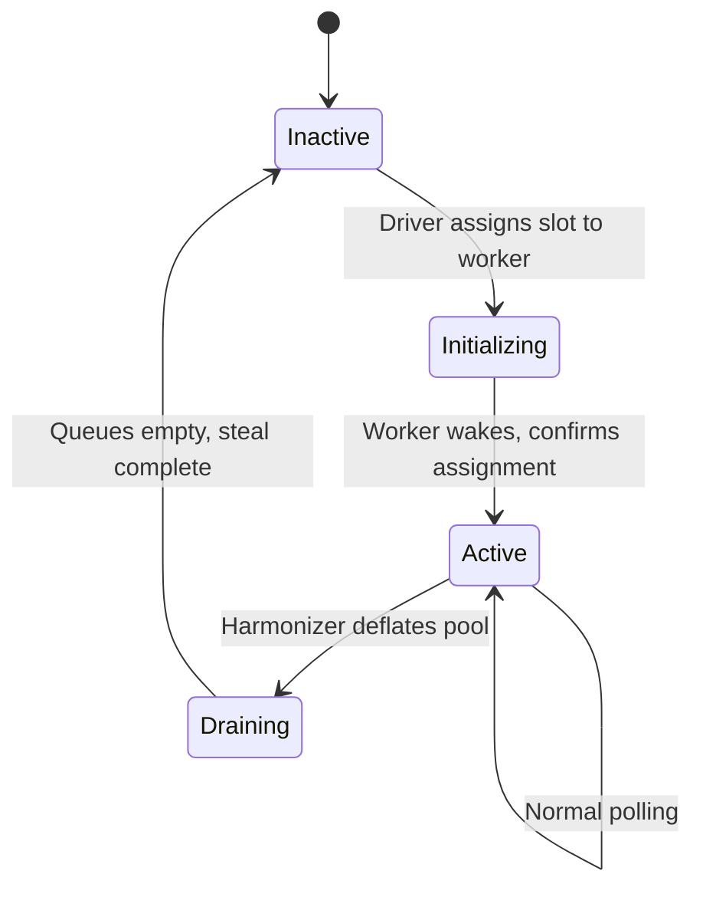
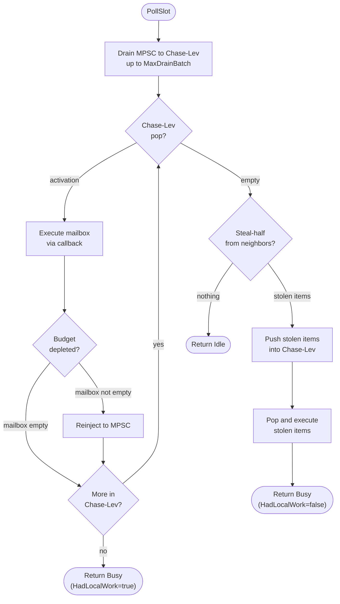
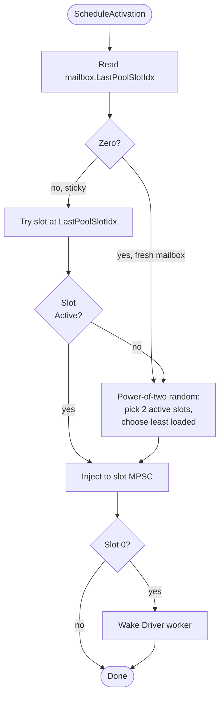

# RFC: Work-Stealing Activation Runtime for YDB Actor System

## Status

Implemented (Steps 0-16 complete). Benchmarks show WS competitive at high parallelism, with known overhead for sparse/sequential workloads (chain). See Section 11 for benchmark results.

## 1. Problem Statement

The YDB actor system dispatches activations through a single shared MPMC ring queue per executor pool (`TMPMCRingQueueV4Correct<20>`). Every push increments a shared `Tail` counter via `fetch_add`; every pop increments a shared `Head` counter via `fetch_add`. Both are serializing atomics that require exclusive cache line ownership.

On modern many-core hardware, cache coherence round-trip latency between chiplets and sockets bounds the throughput of a single contended atomic counter to roughly 5-12M ops/sec on x86 and 3-8M ops/sec on ARM, regardless of core count. YDB generates 15-50M activations/sec under production OLTP workloads. The queue saturates well before CPU capacity is exhausted.

The [contention analysis](contention-analysis.md) quantifies this in detail. Key findings:

| Configuration | Queue throughput ceiling | YDB demand |
|---------------|------------------------|------------|
| 192 threads, 1 socket (EPYC 9654) | 10-15M act/sec | 15-50M act/sec |
| 384 threads, 2 sockets (EPYC 9654) | 4-6M act/sec | 15-50M act/sec |

At 384 threads, the overhead ratio is 8-150x: threads spend more time in CAS retry loops and coherence waits than executing actors.

### Target Hardware

- **AMD EPYC 9654/9755** (Zen 4/5): 96-128 cores per socket, 12-16 CCDs per socket, cross-CCD coherence 40-80ns, cross-socket 120-200ns
- **NVIDIA Grace** (Neoverse V2): 144 cores, CMN-700 mesh, LL/SC more contention-sensitive than x86 LOCK XADD

## 2. Proposed Architecture

Replace the single shared MPMC queue with per-slot local queues and work stealing between slots. Decouple thread management from pools into a system-wide Driver. The implementation is opt-in, co-exists with the existing runtime at compile time, and is gated by configuration.

### System Overview



**Key properties:**
- Pools own slot arrays and route activations to slots. Pools do not own threads.
- Driver owns CPU-pinned workers. Workers poll their assigned slots and steal from neighbors.
- A worker may poll slots from multiple pools (configurable, subject to latency budgets).
- Slot 0 of each pool has a wake mechanism to unpark its assigned worker.

### Slot State Machine

Each slot has a lifecycle managed by the Driver in response to harmonizer inflation/deflation.



- **Inactive:** not polled, not accepting activations.
- **Initializing:** assigned but worker has not yet started polling. Activations not routed here.
- **Active:** polled by worker, accepts activations, can be stolen from.
- **Draining:** no new activations routed, but existing work and steals continue until empty.

### Polling Routine

The core loop executed by each worker for each assigned slot.



**Key details:**
- Step 2 drains once, then processes all available activations before returning. This prevents LIFO starvation where recently re-injected activations perpetually bury older ones.
- Stolen items are pushed into the local Chase-Lev deque, then popped and executed. Overflow goes to the MPSC (reinject).
- `HadLocalWork` flag distinguishes local work from stolen work, used by the Worker loop for parking decisions (see TThreadDriver).
- Steal traversal follows circular neighbor order with exponential backoff on consecutive failures.

### Activation Routing

When `ScheduleActivation` is called, the pool routes the activation to a slot:



After executing a mailbox, the slot writes its own index to `mailbox.LastPoolSlotIdx` (relaxed store), providing cache-locality stickiness. Stolen mailboxes naturally reassign to the stealing slot's CPU.

**Deferred reinjection:** When `ScheduleActivationEx` is called for the mailbox currently being executed (e.g., from `TryUnlock` inside `Execute`), the reinjection is deferred until after `Execute` completes. This prevents a race where the mailbox re-enters the slot's queues while still locked for execution. Other mailboxes are routed immediately via `RouteActivation`.


## 3. Data Structures

### Chase-Lev Bounded SPMC Deque

`TChaseLevDeque<T, Capacity>` -- header-only, power-of-2 capacity, bounded.

| Operation | Caller | Contention | Memory ordering |
|-----------|--------|------------|-----------------|
| `Push(T)` | Owner only | None | `bottom`: relaxed store; buffer slot: relaxed store; fence: release before bottom update |
| `PopOwner()` | Owner only | Rare CAS on last element | `bottom`: relaxed; `top`: seq_cst CAS on last-element race |
| `StealHalf(out, max)` | Any stealer | Per-item CAS on `top` | `top`: seq_cst CAS per item; buffer slots: relaxed load (after acquire on top) |
| `StealOne()` | Any stealer | CAS on `top` | Same single-item protocol |

Owner push/pop is contention-free in the common case. Stealers only appear when their own deque is empty. The deque is also reused as the node reclaim pool for the MPSC queue (see below).

**StealHalf uses per-item CAS**, not a single batch CAS. A batch `CAS(top, t, t+half)` is unsafe: between reading the buffer slots and the CAS, the owner's `PopOwner` can pop items from the bottom into the stealer's claimed range. The batch CAS only prevents other stealers, not the owner. Per-item CAS follows the correct Chase-Lev single-steal protocol for each item, where the seq_cst total order between `PopOwner`'s `Bottom_` store and the stealer's `Top_` CAS prevents duplicate claiming. This is the same approach used by Go's runtime scheduler.

Based on Chase & Lev (SPAA 2005) with Le et al. (PPoPP 2013) corrections for weak memory models.

### Vyukov MPSC Queue with Node Pool

`TVyukovMPSCQueue<T, PoolThreshold>` -- intrusive, wait-free push, lock-free pop.

| Operation | Caller | Contention | Memory ordering |
|-----------|--------|------------|-----------------|
| `Push(T)` | Any producer | XCHG on tail | `tail`: exchange (acq_rel); `prev->next`: release store |
| `TryPop()` | Single consumer | None | `head->next`: acquire load |
| `DrainTo(out, max)` | Single consumer | None | Same as TryPop, batched |

When `PoolThreshold > 0`, producers call `NodePool.StealOne()` (Chase-Lev steal) for a hot allocation node before falling back to `new`. The consumer reclaims drained nodes back into the pool via `NodePool.Push()` (Chase-Lev owner push). This keeps node allocation on the fast path.

A permanent stub sentinel avoids the incomplete-push ABA problem inherent in Vyukov's original design.


## 4. Driver Design

### IDriver Interface

```cpp
class IDriver {
public:
    virtual void Prepare(const TCpuTopology& topology) = 0;
    virtual void Start() = 0;
    virtual void PrepareStop() = 0;
    virtual void Shutdown() = 0;

    virtual void RegisterSlot(TSlot* slot) = 0;         // pool registers a slot
    virtual void ActivateSlot(TSlot* slot) = 0;         // harmonizer inflates
    virtual void DeactivateSlot(TSlot* slot) = 0;       // harmonizer deflates
    virtual void WakeSlot(TSlot* slot) = 0;             // wake worker owning this slot

    virtual void SetWorkerCallbacks(TSlot* slot, TWorkerCallbacks callbacks) = 0;
    virtual std::unique_ptr<IStealIterator> MakeStealIterator(TSlot* exclude) = 0;
};
```

The pool calls `RegisterSlot` for each slot during setup, then `SetWorkerCallbacks` to provide per-slot execute/setup/teardown callbacks. `WakeSlot` unparks the worker owning a specific slot (called when an activation is routed to a parked worker). The interface isolates pools and slots from threading details.

### TThreadDriver

First implementation: one `TThread` + `TThreadParkPad` per registered slot. Each worker polls its assigned slot.

**Worker loop:** Calls `PollSlot()` in a loop. `PollSlot` returns `Busy` (work executed) or `Idle` (nothing found). The parking strategy uses **time-based spinning with local work distinction**:

- **Local work** (activations from the slot's own queues): resets the spin timer. `PollSlot` sets `pollState.HadLocalWork = true`.
- **Stolen work** (items taken from neighbor deques): does NOT reset the spin timer. `PollSlot` sets `pollState.HadLocalWork = false`.
- **Idle**: spin timer keeps ticking. When `now - lastLocalWorkTs > SpinThresholdCycles`, the worker parks via `TThreadParkPad`.

This distinction ensures workers with no local work eventually park even if they occasionally steal from busy neighbors, while workers with regular local work stay awake. The default `SpinThresholdCycles` is 100,000 (~33μs at 3GHz), comparable to the basic pool's effective spin duration.

**Steal ordering:** `TTopologyStealIterator` iterates over all registered slots in circular order (excluding self), probing up to `MaxStealNeighbors` (default 3) per steal round. The starting position rotates after each steal cycle to distribute steal pressure. True topology-ordered stealing (L3/CCD/NUMA proximity) is prepared by `TCpuTopology` but not yet wired into the iterator.

**Wake mechanism:** When an activation is routed to a parked slot's worker, `WakeSlot()` calls `TThreadParkPad::Unpark()` to wake it promptly.

### TCpuTopology

Discovers CPU relationships from Linux sysfs (`/sys/devices/system/cpu/*/topology/`, `/sys/devices/system/node/*/distance`). Non-Linux builds fall back to flat (equidistant) topology. Provides `GetNeighborsOrdered(cpuId)` returning all CPUs sorted by proximity.


## 5. TActivationContext Strategy

### Problem

`TActivationContext` holds a `TExecutorThread& ExecutorThread`. All static methods (`Send`, `Schedule`, `Register`, etc.) proxy through this reference. The WS runtime has no `TExecutorThread` -- workers are Driver threads polling slots, not executor threads.

### Solution

`TWSExecutorContext` inherits `TExecutorThread` but is never started as a thread.

`TExecutorThread` inherits `ISimpleThread` (= `TThread`). An unstarted `TThread` is a small inert object. The WS context constructor initializes the base class with the pool and actor system references, then never calls `Start()`.

Each Driver worker holds one `TWSExecutorContext` per assigned pool. Before executing a mailbox:

```
TlsActivationContext = TActorContext(mailbox, *wsExecutorContext, eventStart, selfId)
TlsThreadContext = &wsExecutorContext->ThreadCtx
```

All existing code paths work unchanged: `TActivationContext::Send()` calls `ExecutorThread.Send()` which calls `ActorSystem->Send()`. No virtual dispatch, no branching on the hot path.

This approach works independently of PR #34266 (which makes `ExecutorThread` private). The shim IS a `TExecutorThread`, so the reference is valid regardless of access level.


## 6. Configuration Schema

### TCpuManagerConfig Extension

```cpp
struct TWorkStealingPoolConfig {
    ui32 PoolId = 0;
    TString PoolName;
    i16 MinSlotCount = 1;
    i16 MaxSlotCount = 32;
    i16 DefaultSlotCount = 4;
    TDuration TimePerMailbox = TDuration::MilliSeconds(10);
    ui32 EventsPerMailbox = 100;
    i16 Priority = 0;
    NWorkStealing::TWsConfig WsConfig;  // see below
};

struct TWorkStealingConfig {
    bool Enabled = false;
    TVector<TWorkStealingPoolConfig> Pools;
};

struct TWsConfig {
    size_t ChaseLevCapacity = 256;         // SPMC deque size (power of 2)
    size_t MpscPoolThreshold = 64;         // node reclaim pool size (0 = disable)
    size_t MaxDrainBatch = 64;             // max items to drain from MPSC per poll cycle
    size_t MaxExecBatch = 64;              // max activations to execute per PollSlot call
    uint64_t SpinThresholdCycles = 100000; // spin cycles before parking (~33us at 3GHz)
    uint64_t LoadWindowNs = 1000000;       // 1ms -- load estimate window
    uint32_t StarvationGuardLimit = 3;     // consecutive idle cycles before first steal attempt
    uint32_t MaxStealNeighbors = 3;        // max neighbors to probe per steal attempt
    uint16_t MaxSlots = 128;               // max slots per pool
    uint32_t EventsPerMailbox = 100;       // max events per mailbox execution
    uint64_t TimePerMailboxNs = 1000000;   // 1ms -- max time per mailbox execution
    uint32_t ParkAfterIdlePolls = 64;      // (unused, kept for future use)
};
```

When `WorkStealing` is absent or `Enabled` is false, no WS code is instantiated. Matching pools are created as `TWSExecutorPool`; non-matching pools remain `TBasicExecutorPool`. The driver configuration (worker count, topology) is currently derived automatically from the registered slot count.


## 7. Harmonizer Integration

`TWSExecutorPool` implements the `IExecutorPool` interface including thread-count methods. The harmonizer sees it as a regular pool:

| Harmonizer action | WS translation |
|-------------------|----------------|
| `SetFullThreadCount(N+1)` | `Driver->ActivateSlot()`: Inactive -> Initializing -> Active |
| `SetFullThreadCount(N-1)` | `Driver->DeactivateSlot()`: Active -> Draining -> Inactive |
| `GetThreadCpuConsumption(i)` | Returns slot `i`'s load estimate (stub, returns zero) |
| `GetThreads()` / `GetThreadCount()` | Returns active slot count |

Per-slot counters track executions, drain/steal/idle/busy polls, parks, wakes, and stolen items. These are exposed via `AggregateCounters()` for diagnostics. Full `TCpuConsumption` integration with the harmonizer (mapping per-slot execution time to harmonizer's per-thread view) is not yet implemented — current benchmarks use fixed slot counts.


## 8. NUMA Considerations

The architecture is NUMA-ready by design, but NUMA-specific optimizations are deferred until benchmarks confirm single-NUMA improvement.

**Already built in:**
- `TCpuTopology` discovers NUMA node distances from sysfs
- Steal iterator ordering includes NUMA distance (same-NUMA before cross-NUMA)
- Driver worker-to-CPU pinning respects NUMA placement

**Deferred:**
- NUMA-local-first slot inflation (prefer activating slots on the same NUMA node)
- Per-NUMA-node slot allocation for large pools
- NUMA-aware power-of-two redistribution (prefer same-NUMA slots in routing)
- NUMA-aware mailbox memory allocation


## 9. Prior Art

### Go Runtime Scheduler

Per-P (processor) local run queue (bounded ring, 256 slots) + global run queue + work stealing from random other P. Each goroutine schedules onto its last P for locality. When local queue is empty, steal half from a random P or take from global queue.

**Relevance:** Direct inspiration for the per-slot model with sticky routing and steal-half semantics.

### Rust Tokio

Per-worker LIFO slot (single most recent task for temporal locality) + per-worker SPMC deque + global injection queue. Workers steal from random other workers when idle.

**Relevance:** Validates the MPSC injection + SPMC steal pattern at production scale. Tokio's injection queue maps to our per-slot MPSC.

### Cilk / Intel TBB

Chase-Lev deque (SPAA 2005) originated in Cilk for fork-join work stealing. Intel TBB adopted the same structure. Stealers take from the opposite end of the deque (FIFO for stealers, LIFO for owner), providing good cache behavior for divide-and-conquer workloads.

**Relevance:** The Chase-Lev deque is our per-slot SPMC structure.

### Java ForkJoinPool

Per-worker bounded deques with work stealing. Uses `volatile` fields and Unsafe CAS. Work-stealing order is random; no topology awareness.

**Relevance:** Demonstrates work stealing in managed runtimes with bounded deques and dynamic worker scaling (similar to our harmonizer-driven slot inflation).

### SPDK

Storage Performance Development Kit uses pollers (non-blocking poll functions) and reactors (threads that loop over pollers). Interrupt-driven mode parks reactors when idle and wakes them on I/O completion.

**Relevance:** Reference for Driver interface design. An SPDK-based driver could replace `TThreadDriver` to integrate YDB actors with SPDK's reactor loop.


## 10. Implementation Plan Summary

All 17 steps are complete. 142 unit tests pass, including stress tests with concurrent stealers.

```
Step 0  Contention Analysis           ✓
Step 1  RFC Document                  ✓ (this document)
Step 2  Chase-Lev SPMC Deque          ✓ (header-only, per-item CAS steal)
Step 3  Vyukov MPSC Queue             ✓ (header-only, node pool)
Step 4  CPU Topology Discovery        ✓ (sysfs parser, flat fallback)
Step 5  Slot Struct + State Machine   ✓ (MPSC + Chase-Lev, 4-state FSM)
Step 6  Activation Router             ✓ (sticky + power-of-two random)
Step 7  Poll + Steal Functions        ✓ (drain/pop/steal/execute loop)
Step 8  Driver + TThreadDriver        ✓ (one thread per slot, time-based parking)
Step 9  TActivationContext Shim       ✓ (inherits TExecutorThread, never started)
Step 10 WS Executor Pool              ✓ (IExecutorPool impl, deferred reinjection)
Step 11 Feature Flags + Config        ✓ (opt-in via TCpuManagerConfig)
Step 12 CPU Manager Integration       ✓ (creates TWSExecutorPool + TThreadDriver)
Step 13 Harmonizer Adapter            ✓ (basic: slot count maps to thread count)
Step 14 Existing Test Parameterization ✓ (stress + integration tests)
Step 15 Data Structure Benchmarks     ✓ (Chase-Lev + Vyukov microbenchmarks)
Step 16 System-level A/B Benchmarks   ✓ (ping-pong, star, chain; CSV + CPU util)
```


## 11. Benchmark Results

System-level A/B benchmarks comparing `TBasicExecutorPool` vs `TWSExecutorPool` on a 32-core machine. 5-second measurement, 1-second warmup.

### Ping-Pong (parallel actor pairs)

| Threads | Pairs | Basic ops/s | WS ops/s | Δ | Basic CPU% | WS CPU% |
|---------|-------|------------|---------|---|-----------|---------|
| 1 | 100 | 361K | 367K | +2% | 102 | 102 |
| 4 | 10 | 951K | 1152K | **+21%** | 100 | 100 |
| 8 | 100 | 1831K | 1679K | -8% | 100 | 100 |
| 16 | 100 | 3501K | 3119K | -11% | 100 | 100 |
| 32 | 10 | 2310K | 2576K | **+12%** | 98 | **63** |
| 32 | 100 | 5822K | 5141K | -12% | 98 | 98 |

### Star (fan-in: N senders to 1 receiver)

| Threads | Senders | Basic ops/s | WS ops/s | Δ | Basic CPU% | WS CPU% |
|---------|---------|------------|---------|---|-----------|---------|
| 2 | 10 | 72K | 79K | **+10%** | 101 | 101 |
| 8 | 10 | 311K | 340K | **+9%** | 100 | 100 |
| 16 | 10 | 496K | 415K | -16% | 95 | **69** |
| 32 | 10 | 518K | 477K | -8% | **54** | **34** |

### Chain (sequential ring of N actors)

| Threads | Chain len | Basic ops/s | WS ops/s | Δ | Basic CPU% | WS CPU% |
|---------|-----------|------------|---------|---|-----------|---------|
| 1 | 10 | 366K | 340K | -7% | 102 | 102 |
| 2 | 100 | 304K | 497K | **+63%** | 101 | 101 |
| 8 | 10 | 300K | 263K | -12% | **52** | 100 |
| 16 | 10 | 437K | 283K | -35% | **33** | **63** |
| 32 | 10 | 305K | 292K | -4% | **15** | **31** |
| 32 | 100 | 296K | 123K | -59% | **17** | **98** |

### Analysis

**WS wins** in high-parallelism scenarios (ping-pong 4t, 32t/10p; star 2-8t) where per-slot queues eliminate MPMC contention. At 32 threads with 10 actor pairs, WS is 12% faster using 35% less CPU.

**WS loses** in sequential/sparse workloads (chain 8+ threads) where:
1. Workers with rare local work spin at 100% CPU (activations arrive within the 33μs spin threshold).
2. Failed steal attempts (99%+ failure rate) cause cache line contention.

The basic pool avoids these issues through its shared MPMC queue: idle threads park quickly because work goes to whichever thread is spinning, not to a specific slot.

**Known optimizations not yet implemented:**
- Topology-aware steal ordering (L3/CCD/NUMA proximity)
- Adaptive spin threshold based on per-slot activation rate
- Steal attempt reduction (empty-check before CAS, lower steal frequency for idle slots)
- Full harmonizer integration (dynamic slot inflation/deflation)


## References

1. Chase, D. and Lev, Y. "Dynamic Circular Work-Stealing Deque." SPAA 2005.
2. Le, N.M., Pop, A., Cohen, A., and Zappa Nardelli, F. "Correct and Efficient Work-Stealing for Weak Memory Models." PPoPP 2013.
3. Vyukov, D. "Intrusive MPSC node-based queue." 1024cores.net, 2010.
4. Go runtime scheduler. `runtime/proc.go` in the Go source tree.
5. Tokio (Rust). `tokio/src/runtime/scheduler/multi_thread/`.
6. Lozi et al. "Remote Core Locking." USENIX ATC 2012.
7. Dice, Lev, Moir. "Scalable Statistics Counters." SPAA 2013.
