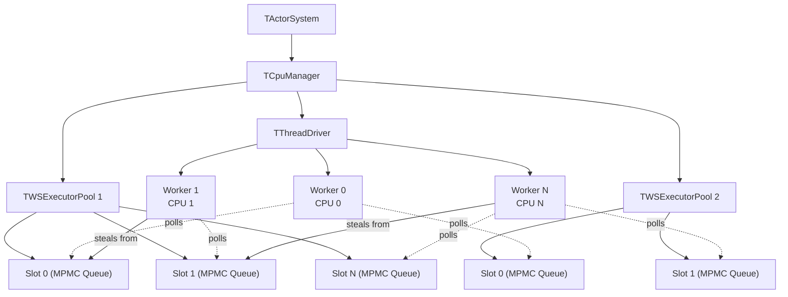
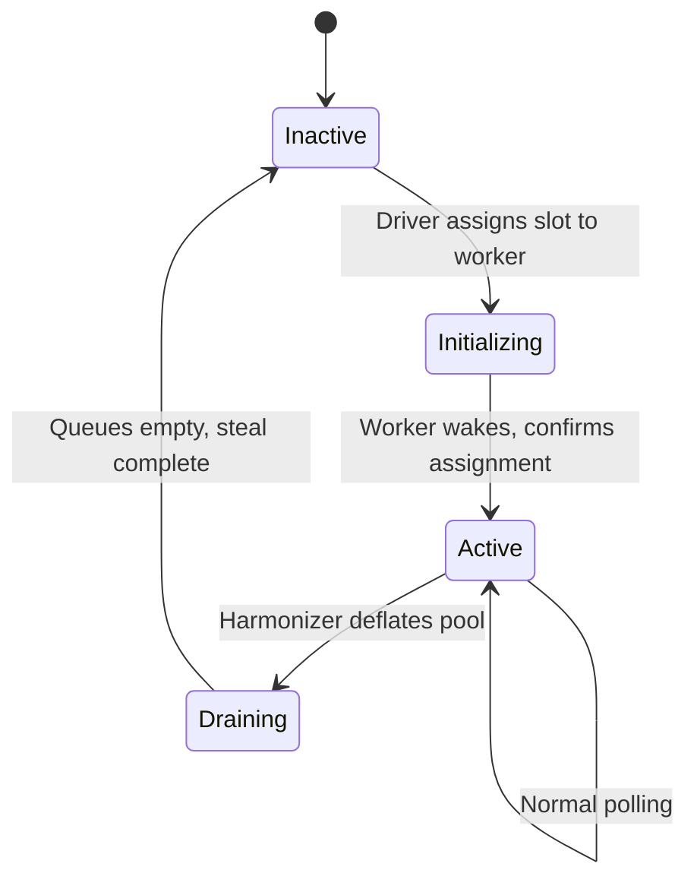
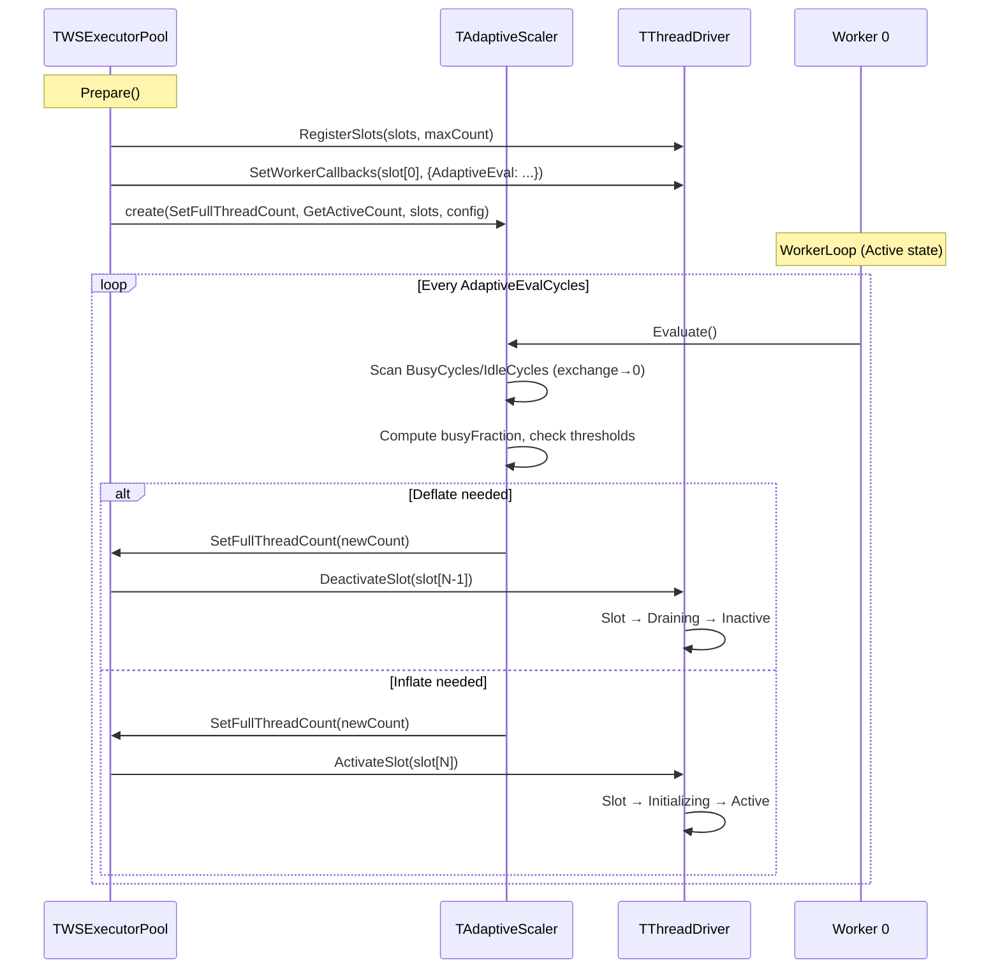

# RFC: Work-Stealing Activation Runtime for YDB Actor System

## Status

Implemented (Steps 0-16 complete, plus post-v1 optimizations including continuation ring and adaptive slot scaling). Benchmarks on 2×EPYC 9654 (384 threads) show WS 1.3-4.5× faster on ping-pong, 1.2-1.8× on star, 1.2-2.4× on chain, 1.3-5.9× on pipeline for the best configurations. Adaptive scaling eliminates the 97.8% CPU regression on overprovisioned workloads (chain 384t/1000p: 3.1% CPU, 3.4× throughput vs non-adaptive). See Section 13 for full results and Section 9 for adaptive scaling.

## 1. Problem Statement

The YDB actor system dispatches activations through a single shared MPMC ring queue per executor pool (`TMPMCRingQueueV4Correct<20>`). Every push increments a shared `Tail` counter via `fetch_add`; every pop increments a shared `Head` counter via `fetch_add`. Both are serializing atomics that require exclusive cache line ownership.

On modern many-core hardware, cache coherence round-trip latency between chiplets and sockets bounds the throughput of a single contended atomic counter to roughly 5-12M ops/sec on x86 and 3-8M ops/sec on ARM, regardless of core count. YDB generates 15-50M activations/sec under production OLTP workloads. The queue saturates well before CPU capacity is exhausted.

The [contention analysis](contention-analysis.md) quantifies this in detail. Key findings:

| Configuration | Queue throughput ceiling | YDB demand |
|---------------|------------------------|------------|
| 192 threads, 1 socket (EPYC 9654) | 10-15M act/sec | 15-50M act/sec |
| 384 threads, 2 sockets (EPYC 9654) | 4-6M act/sec | 15-50M act/sec |

At 384 threads, the overhead ratio is 8-150x: threads spend more time in CAS retry loops and coherence waits than executing actors.

### Target Hardware

- **AMD EPYC 9654/9755** (Zen 4/5): 96-128 cores per socket, 12-16 CCDs per socket, cross-CCD coherence 40-80ns, cross-socket 120-200ns
- **NVIDIA Grace** (Neoverse V2): 144 cores, CMN-700 mesh, LL/SC more contention-sensitive than x86 LOCK XADD


## 2. Proposed Architecture

Replace the single shared MPMC queue with per-slot local queues and work stealing between slots. Decouple thread management from pools into a system-wide Driver. The implementation is opt-in, co-exists with the existing runtime at compile time, and is gated by configuration.

### System Overview



**Key properties:**
- Pools own slot arrays and route activations to slots. Pools do not own threads.
- Driver owns CPU-pinned workers. Workers poll their assigned slots and steal from neighbors.
- A worker may poll slots from multiple pools (configurable, subject to latency budgets).
- Slot 0 of each pool has a wake mechanism to unpark its assigned worker.

### Slot State Machine

Each slot has a lifecycle managed by the Driver in response to harmonizer inflation/deflation.



- **Inactive:** not polled, not accepting activations.
- **Initializing:** assigned but worker has not yet started polling. Activations not routed here.
- **Active:** polled by worker, accepts activations, can be stolen from.
- **Draining:** no new activations routed, but existing work and steals continue until empty.

### Polling Routine

The core loop executed by each worker for each assigned slot. Uses a **continuation ring** with **time-based batching** for execution, and **topology-aware work stealing** when idle.

- **Seeding:** If the continuation ring has items from a previous PollSlot (mailboxes that exhausted the event budget), pop one to seed the loop. This gives hot mailboxes first-execution priority. When the ring is empty, this is a no-op — zero overhead on the common path.

- **Queue processing:** Pop activations from the MPMC queue and execute with a `MaxExecBatch` event budget. Each mailbox runs for up to `MailboxBatchCycles` (~17μs at 3GHz). When the time slice expires, check the queue inline: if other work is waiting, push current to queue tail and pop next (inline swap); if empty, reset the deadline and continue the same mailbox. If the budget is exhausted while a mailbox still has events, that mailbox is saved to the continuation ring for the next PollSlot call.

- **Stealing:** If no work found, try stealing from neighbor slots with exponential backoff. Stolen items are executed directly from a stack buffer (no reinjection into the queue).


**Key details:**
- **Continuation ring seeding:** The ring holds activations that exhausted the entire event budget — proven hottest. One item is popped per PollSlot for priority execution. When the ring is empty, seeding falls through to `slot.Pop()` — identical to the pre-ring code path.
- **Inline interleaving:** When a mailbox's time slice expires, the loop checks the queue inline. If another activation is waiting, it pushes the current activation to queue tail and pops the next — swapping without leaving the inner loop. Only budget-exhaustion leftovers go to the ring (not time swaps), ensuring the ring holds only the hottest actors. If the queue is empty, the deadline resets and the same mailbox continues — avoiding unnecessary MPMC push/pop overhead and false steal potential.
- **Direct steal execution:** Stolen items are executed directly from a stack buffer on the stealer's stack. Only items that still have events after execution are pushed to the local queue. This avoids re-steal races.
- `HadLocalWork` flag distinguishes local work from stolen work, used by the Worker loop for parking decisions.
- Before probing a victim, the stealer checks `SizeEstimate() == 0` and `Executing == false` and skips empty/idle slots.
- The ring's `ContinuationCount` is exported to the activation router, which includes it in load estimates for routing decisions. This prevents the router from overloading slots whose MPMC queue looks empty but whose ring is occupied.

### Continuation Ring

#### Problem: Fan-In Budget Exhaustion

In fan-in workloads (N senders → 1 receiver), the receiver mailbox accumulates events faster than PollSlot can drain them. When `MaxExecBatch` (64 events) is exhausted while the receiver still has work, the original (pre-continuation) approach pushed the activation to the **end** of the slot's MPMC queue:

```
Before: PollSlot exhausts budget on receiver (R)
Queue state: [S1, S2, S3, ..., SN]
             ← R pushed here →  [S1, S2, S3, ..., SN, R]
```

With N senders on the same slot, R waits behind all of them before getting another turn. Each sender generates one more event for R, so when R finally runs again, it has N new events but the same 64-event budget. Effective receiver throughput drops to roughly `1/(N+1)` of slot capacity.

For cheap events (~100 cycles, e.g. star receiver doing `counter++`), the 64-event budget is exhausted after ~6,400 cycles — well before the 50,000-cycle `MailboxBatchCycles` deadline. The push-to-tail is the bottleneck, not time-based interleaving.

#### Attempt 1: Persistent Continuation

First fix: save the hot mailbox in `TPollState::HotContinuation` across PollSlot calls. Each call starts by processing the continuation first, then saves it back if it still has work.

**Result:** Star 4t/10p improved from 157K to 228K (+45%). But star 8t/10p **regressed** from 303K to 71K — a 4× slowdown.

**Root cause — synchronized contention:** Persistent continuation forces all workers to start each PollSlot with their sender continuation (Phase 1). All senders execute simultaneously and call `Send(receiver, msg)`, which routes to `slot.Push(receiverHint)`. With 8 workers doing this in lockstep:

```
Worker 0: Phase1(sender_0) → Send(receiver) → slot[R].Push(hint) ──┐
Worker 1: Phase1(sender_1) → Send(receiver) → slot[R].Push(hint) ──┤ 8 concurrent
Worker 2: Phase1(sender_2) → Send(receiver) → slot[R].Push(hint) ──┤ CAS operations
  ...                                                               │ on same cache line
Worker 7: Phase1(sender_7) → Send(receiver) → slot[R].Push(hint) ──┘
```

Each `Push` is a `fetch_add` on the MPMC queue's tail counter. Under 8-way contention, the cache line bounces between L1 caches, inflating per-event cost from ~700 cycles (uncontended) to ~6,000 cycles. The `MailboxBatchCycles` deadline (50,000 cycles) is hit after only ~8 events instead of 64, wasting 87% of the event budget.

Diagnostic counters confirmed this: `Phase1Deadlines ≈ BusyPolls` (virtually every Phase 1 hit the time deadline), and `Phase1Execs / BusyPolls ≈ 8` (only 8 events per Phase 1, not 64).

#### Attempt 2: One-Shot Continuation

Phase 1 consumes the continuation but does **not** save it back. If the mailbox still has events after Phase 1's budget, it's pushed to the queue — where Phase 2 and other activations interleave fairly. Only Phase 2's leftover (if any) becomes the next continuation.

This breaks the synchronization: Phase 1 is brief, workers desynchronize in Phase 2, and the continuation mechanism only engages when there's actual sustained load. One-shot eliminated the 8t regression while preserving the fan-in improvement.

#### Solution: Continuation Ring with Queue-Only Swaps

The one-shot approach used a single `std::optional<ui32> HotContinuation`. The continuation ring replaces it with a `TContinuationRing` (stack-allocated FIFO, capacity 4, configurable up to 8) that can hold multiple hot activations across PollSlot calls.

**Key design principle:** Only budget-exhaustion leftovers enter the ring. Time-based inline swaps push to the queue, not the ring. This ensures the ring holds only the proven hottest actors — those that consumed the entire `MaxExecBatch` budget.

```
PollSlot call N:
  Seed: Pop from ring → activation A (priority execution)
  Queue loop: Pop B, execute, time swap → push B to queue, pop C
              Continue until budget exhausted on activation D
  Save: Push D to ring (proven hottest)

PollSlot call N+1:
  Seed: Pop from ring → activation D (or A if D drained)
  Queue loop: ...
```

**Why queue-only swaps?** Promoting time-swap items to the ring dilutes it with less-hot actors. In star workloads, this fills the ring with senders that survive one time slice, pushing out the truly hot hub actor. Queue-only swaps keep the ring reserved for budget-exhaustion survivors — the actors that consistently consume the most events per PollSlot.

**Ring occupancy for routing:** Each slot exports `ContinuationCount` (ring size) as a relaxed atomic. The activation router includes this in load estimates, preventing the router from overloading slots whose MPMC queue looks empty but whose ring is occupied.

#### Flush Invariants

A locked mailbox must never be abandoned in the continuation ring. The worker must flush the ring (push all items to queue) before:

1. **Draining** (slot transitioning to `Inactive`): flush before Dekker `WorkerSpinning=false` so `HasWork()` sees it
2. **Parking** (spin timeout): flush before Dekker protocol
3. **Shutdown** (worker loop exit): flush before teardown

See `thread_driver.cpp:WorkerLoop()` for the three flush points.

### Activation Routing

When `ScheduleActivation` is called, the pool routes the activation to a slot:


After executing a mailbox, the slot writes its own index to `mailbox.LastPoolSlotIdx` (before unlocking the mailbox), providing cache-locality stickiness. The load-aware check prevents hot sticky slots from accumulating all activations when load is unbalanced (e.g. 10 actor pairs on 32 slots).

**Deferred reinjection:** When `ScheduleActivationEx` is called for the mailbox currently being executed (e.g., from `TryUnlock` inside `Execute`), the reinjection is deferred until after `Execute` completes. This prevents a race where the mailbox re-enters the slot's queues while still locked for execution.


## 3. Data Structures

### MPMC Unbounded Queue (current)

`TMPMCUnboundedQueue<SegmentSize>` — segment-based, lock-free, unbounded.

The original plan used Chase-Lev (SPMC) + Vyukov (MPSC) dual queues per slot. During implementation, this was replaced with a single MPMC unbounded queue that supports both concurrent push and pop from any thread, plus batch `StealHalf`. This simplified the slot API (no drain step) and eliminated the injection-to-deque copy bottleneck.

| Operation | Caller | Contention | Memory ordering |
|-----------|--------|------------|-----------------|
| `Push(T)` | Any thread | `fetch_add` on segment tail | Release on slot write |
| `Pop()` | Any thread | CAS on segment head | Acquire on slot read |
| `StealHalf(out, max)` | Any stealer | Snapshot + batch CAS | Seq_cst on size snapshot |

Segments of `SegmentSize` slots are allocated on demand. Empty segments are reclaimed via DEBRA (Deferred Epoch-Based Reclamation) — a lightweight epoch scheme that defers `delete` until all threads have passed through a quiescent state. This avoids unbounded memory growth while remaining lock-free.

`SizeEstimate()` returns an approximate queue depth via a relaxed atomic counter, used by the activation router for load-aware decisions without traversing segments.

### Design Note: Why MPMC Instead of Chase-Lev + Vyukov

The original RFC specified Chase-Lev SPMC deque (owner pop, stealer steal-half) + Vyukov MPSC queue (multi-producer injection, single-consumer drain). This required a drain step in PollSlot to copy items from MPSC to Chase-Lev before processing. The drain introduced:
1. An extra copy per activation on the hot path
2. Complexity in bounding the drain batch vs. Chase-Lev capacity
3. A single-consumer bottleneck on the MPSC queue

The MPMC queue eliminates all three: any thread can push (replacing MPSC), any thread can pop (replacing Chase-Lev owner pop), and StealHalf provides batch stealing. The trade-off is slightly higher per-operation cost (CAS instead of relaxed store for push), but this is offset by eliminating the drain copy.


## 4. Driver Design

### IDriver Interface

```cpp
class IDriver {
public:
    virtual void Prepare(const TCpuTopology& topology) = 0;
    virtual void Start() = 0;
    virtual void PrepareStop() = 0;
    virtual void Shutdown() = 0;

    virtual void RegisterSlot(TSlot* slot) = 0;         // pool registers a slot
    virtual void ActivateSlot(TSlot* slot) = 0;         // harmonizer inflates
    virtual void DeactivateSlot(TSlot* slot) = 0;       // harmonizer deflates
    virtual void WakeSlot(TSlot* slot) = 0;             // wake worker owning this slot

    virtual void SetWorkerCallbacks(TSlot* slot, TWorkerCallbacks callbacks) = 0;
    virtual std::unique_ptr<IStealIterator> MakeStealIterator(TSlot* exclude) = 0;
};
```

The pool calls `RegisterSlot` for each slot during setup, then `SetWorkerCallbacks` to provide per-slot execute/setup/teardown callbacks. `WakeSlot` unparks the worker owning a specific slot (called when an activation is routed to a parked worker). The interface isolates pools and slots from threading details.

### TThreadDriver

First implementation: one `TThread` + `TThreadParkPad` per registered slot. Each worker polls its assigned slot.

**Worker loop:** Calls `PollSlot()` in a loop. `PollSlot` returns `Busy` (work executed) or `Idle` (nothing found). The parking strategy combines **time-based spinning with local work distinction** and **adaptive spin thresholds**:

- **Local work** (activations from the slot's own queues): resets the spin timer and promotes the spin threshold to `SpinThresholdCycles` (100K cycles, ~33μs). `PollSlot` sets `pollState.HadLocalWork = true`.
- **Stolen work** (items taken from neighbor queues): does NOT reset the spin timer. `PollSlot` sets `pollState.HadLocalWork = false`.
- **Idle**: spin timer keeps ticking. When `now - lastLocalWorkTs > spinThreshold`, the worker parks via `TThreadParkPad`.
- **Adaptive threshold:** Workers start with `MinSpinThresholdCycles` (10K cycles, ~3μs) after each wake or startup. Only local work promotes the threshold to the full `SpinThresholdCycles`. Workers that never receive local work park within ~3μs instead of ~33μs.

This design ensures idle workers park fast (saving CPU), while workers with steady local work spin long enough to avoid park/wake overhead. Workers that only steal from neighbors spin briefly then park — they're helping but shouldn't burn CPU indefinitely.

**Steal ordering:** `TTopologyStealIterator` iterates over all registered slots in circular order (excluding self), probing up to `MaxStealNeighbors` (default 3) per steal round. The starting position rotates after each steal cycle to distribute steal pressure. True topology-ordered stealing (L3/CCD/NUMA proximity) is prepared by `TCpuTopology` but not yet wired into the iterator.

**Wake elimination via Dekker protocol:** Each slot has an atomic `WorkerSpinning` flag and a `DriverData` pointer (eliminates hash map lookup). The protocol:

1. Worker sets `WorkerSpinning = true` (release) when entering the poll loop.
2. Before parking: worker sets `WorkerSpinning = false` (seq_cst), then re-checks `HasPendingInjections()`. If work arrived, cancel park and continue spinning.
3. `WakeSlot()` reads `WorkerSpinning` (seq_cst). If true, the worker is actively polling and will find the work — skip Unpark entirely.

The seq_cst ordering on both sides forms a Dekker-like protocol: either the worker sees the injection (and doesn't park) or `WakeSlot` sees `WorkerSpinning=false` (and calls Unpark). This eliminates >99.99% of wakes in benchmarks — millions of redundant `Unpark()` calls reduced to single digits.

### TCpuTopology

Discovers CPU relationships from Linux sysfs (`/sys/devices/system/cpu/*/topology/`, `/sys/devices/system/node/*/distance`). Non-Linux builds fall back to flat (equidistant) topology. Provides `GetNeighborsOrdered(cpuId)` returning all CPUs sorted by proximity.


## 5. Mailbox Execution Model

### Single-Event with Time-Based Batching

The execute callback processes **one event at a time** from the mailbox. PollSlot calls it in a loop for up to `MailboxBatchCycles` (default 50,000 cycles, ~17μs at 3GHz), then pushes the activation hint back into the MPMC queue if events remain.

```
ExecuteCallback(hint) -> bool
    true:  event processed, more may remain
    false: mailbox drained and finalized (unlocked)
```

**Why single-event + time-based batch:**

The basic pool's `TExecutorThread::Execute()` processes up to 100 events per mailbox visit, holding the mailbox locked. For work-stealing, this creates two problems:

1. **Starvation:** A self-sending actor (events always in mailbox) would monopolize the worker indefinitely if we processed all events before returning.
2. **Star regression:** Pure single-event processing (batch size = 1) adds MPMC queue push/pop overhead per event. In fan-in workloads (N senders → 1 receiver), this overhead dominates because the receiver's mailbox always has events and gets pushed/popped every cycle.

The time-based batch is the compromise: process events from one mailbox for up to ~17μs, then push back and give other activations a turn. This amortizes queue overhead (fixing star regression) while maintaining fairness (fixing starvation).

**TSAN-critical ordering:** `mailbox->LastPoolSlotIdx` must be written BEFORE `FinishMailbox()` (which calls `Unlock`). After unlock, another thread can read `LastPoolSlotIdx` via `RouteActivation`. Writing after unlock is a data race.


## 6. TActivationContext Strategy

### Problem

`TActivationContext` holds a `TExecutorThread& ExecutorThread`. All static methods (`Send`, `Schedule`, `Register`, etc.) proxy through this reference. The WS runtime has no `TExecutorThread` -- workers are Driver threads polling slots, not executor threads.

### Solution

`TWSExecutorContext` inherits `TExecutorThread` but is never started as a thread.

`TExecutorThread` inherits `ISimpleThread` (= `TThread`). An unstarted `TThread` is a small inert object. The WS context constructor initializes the base class with the pool and actor system references, then never calls `Start()`.

Each Driver worker holds one `TWSExecutorContext` per assigned pool. Before executing a mailbox:

```
TlsActivationContext = TActorContext(mailbox, *wsExecutorContext, eventStart, selfId)
TlsThreadContext = &wsExecutorContext->ThreadCtx
```

All existing code paths work unchanged: `TActivationContext::Send()` calls `ExecutorThread.Send()` which calls `ActorSystem->Send()`. No virtual dispatch, no branching on the hot path.

This approach works independently of PR #34266 (which makes `ExecutorThread` private). The shim IS a `TExecutorThread`, so the reference is valid regardless of access level.


## 7. Configuration Schema

### TCpuManagerConfig Extension

```cpp
struct TWorkStealingPoolConfig {
    ui32 PoolId = 0;
    TString PoolName;
    i16 MinSlotCount = 1;
    i16 MaxSlotCount = 32;
    i16 DefaultSlotCount = 4;
    TDuration TimePerMailbox = TDuration::MilliSeconds(10);
    ui32 EventsPerMailbox = 100;
    i16 Priority = 0;
    NWorkStealing::TWsConfig WsConfig;  // see below
};

struct TWorkStealingConfig {
    bool Enabled = false;
    TVector<TWorkStealingPoolConfig> Pools;
};

struct TWsConfig {
    size_t MaxExecBatch = 64;              // max events per PollSlot call (across all mailboxes)
    uint64_t MailboxBatchCycles = 50000;   // max cycles per mailbox before push-back (~17us at 3GHz)
    uint64_t SpinThresholdCycles = 100000; // max spin cycles before parking (~33us at 3GHz)
    uint64_t MinSpinThresholdCycles = 10000; // initial spin after wake (~3us at 3GHz)
    uint64_t LoadWindowNs = 1000000;       // 1ms -- load estimate window
    uint32_t StarvationGuardLimit = 3;     // consecutive idle cycles before first steal attempt
    uint32_t MaxStealNeighbors = 3;        // max neighbors to probe per steal attempt
    uint16_t MaxSlots = 128;               // max slots per pool
    uint32_t EventsPerMailbox = 100;       // max events per mailbox execution
    uint64_t TimePerMailboxNs = 1000000;   // 1ms -- max time per mailbox execution
    uint8_t ContinuationRingCapacity = 4;  // max items in continuation ring (1-8)
    uint32_t ParkAfterIdlePolls = 64;      // (unused, kept for future use)

    // Adaptive slot scaling (see Section 9)
    bool AdaptiveScaling = false;               // master switch
    uint64_t AdaptiveEvalCycles = 30000000;     // ~10ms at 3GHz between evaluations
    uint64_t AdaptiveCooldownCycles = 90000000; // ~30ms cooldown after scaling change
    double InflateUtilThreshold = 0.8;          // inflate when >=80% of active slots busy
    double DeflateUtilThreshold = 0.3;          // deflate when <30% of active slots busy
    double SlotBusyThreshold = 0.1;             // slot considered "busy" if >10% utilization
    uint32_t QueuePressureThreshold = 16;       // inflate if any slot queue depth exceeds this
};
```

When `WorkStealing` is absent or `Enabled` is false, no WS code is instantiated. Matching pools are created as `TWSExecutorPool`; non-matching pools remain `TBasicExecutorPool`. The driver configuration (worker count, topology) is currently derived automatically from the registered slot count.


## 8. Harmonizer Integration

`TWSExecutorPool` implements the `IExecutorPool` interface including thread-count methods. The harmonizer sees it as a regular pool:

| Harmonizer action | WS translation |
|-------------------|----------------|
| `SetFullThreadCount(N+1)` | `Driver->ActivateSlot()`: Inactive -> Initializing -> Active |
| `SetFullThreadCount(N-1)` | `Driver->DeactivateSlot()`: Active -> Draining -> Inactive |
| `GetThreadCpuConsumption(i)` | Returns slot `i`'s load estimate (stub, returns zero) |
| `GetThreads()` / `GetThreadCount()` | Returns active slot count |

Per-slot counters track executions, drain/steal/idle/busy polls, parks, wakes, and stolen items. These are exposed via `AggregateCounters()` for diagnostics. Full `TCpuConsumption` integration with the harmonizer (mapping per-slot execution time to harmonizer's per-thread view) is not yet implemented — current benchmarks use fixed slot counts.


## 9. Adaptive Slot Scaling

### Problem

When a WS pool is configured with many slots (e.g. 384 on a 2-socket EPYC) but the workload only needs a few, all workers spin through PollSlot, attempt steals, and burn CPU. The spin threshold (Section 4) parks workers after ~33μs of idle spinning, but the activation router treats all Active slots equally — routing work to high-index slots wakes their workers, which spin briefly and park again. The result is 100% CPU on a workload that basic pool handles at 2%.

Additionally, `TSlotStats.BusyCycles` and `IdleCycles` were never written by the worker loop, so `LoadEstimate` was always 0 and any external harmonizer got no signal.

### Solution: TAdaptiveScaler

A self-contained controller that runs from worker 0, monitors per-slot utilization, and adjusts the active slot count via `SetFullThreadCount`. Slots are deflated from the end (highest index first = topologically farthest, since `RegisterSlots` assigns CPUs from `GlobalCpuOrder_`). Inflation adds from the next available index.

```
┌──────────────────────────────────────────────────────────────────┐
│                        TWSExecutorPool                           │
│                                                                  │
│  Slots:  [0][1][2]...[N-1][N]...[MaxSlots-1]                   │
│           ▲              ▲  ▲                                    │
│           │   Active     │  │  Inactive                          │
│           │◄────────────►│  │◄────────────►│                     │
│           │              │  │              │                     │
│  Deflate removes ────────┘  │              │                     │
│  from the end (farthest)    │              │                     │
│                             │              │                     │
│  Inflate activates ─────────┘              │                     │
│  next available                            │                     │
│                                                                  │
│  ┌─────────────────────┐                                        │
│  │  TAdaptiveScaler    │ ← Evaluate() called from Worker 0      │
│  │  every ~10ms        │                                        │
│  │                     │                                        │
│  │  Reads:  BusyCycles, IdleCycles, QueueDepth                  │
│  │  Writes: SetFullThreadCount(newCount)                        │
│  └─────────────────────┘                                        │
└──────────────────────────────────────────────────────────────────┘
```

### Load Tracking

Workers write cycle counters around every PollSlot call and park:

```
Active state:
    pollStart = rdtsc()
    result = PollSlot(...)
    elapsed = rdtsc() - pollStart

    if (result == Busy)  → BusyCycles.fetch_add(elapsed, relaxed)
    else                 → IdleCycles.fetch_add(elapsed, relaxed)

Park (all 3 sites):
    parkStart = rdtsc()
    ParkPad.Park()
    IdleCycles.fetch_add(rdtsc() - parkStart, relaxed)
```

`BusyCycles` and `IdleCycles` are `std::atomic<uint64_t>` — workers write via `fetch_add(relaxed)`, the scaler reads via `exchange(0, relaxed)` (atomic read-and-reset). Zero overhead on x86_64 (TSO), silences TSAN.

### Evaluate Algorithm

Worker 0 calls `Evaluate()` every `AdaptiveEvalCycles` (~10ms). The algorithm:


### Hysteresis and Stability

The algorithm has three mechanisms to prevent oscillation:

1. **Deadband:** No action when utilization is between 30% and 80%. Only extreme underload or overload triggers scaling.

2. **Cooldown:** After any scaling change, the scaler waits `AdaptiveCooldownCycles` (~30ms) before evaluating again. This gives the system time to stabilize at the new slot count.

3. **Geometric rate limiting:** Deflation never removes more than 50% of active slots per step. Inflation grows by 25% per step. This prevents wild swings:

```
Deflation convergence (384 slots, 10 genuinely busy):

Step 1:  384 → 192  (halve: max(target=12, half=192) = 192)
Step 2:  192 →  96  (halve: max(target=12, half=96)  =  96)
Step 3:   96 →  48  (halve: max(target=12, half=48)  =  48)
Step 4:   48 →  24  (halve: max(target=12, half=24)  =  24)
Step 5:   24 →  24  (deadband: 10/24=42% > 30%, no action)

Total convergence: ~4 steps × (10ms eval + 30ms cooldown) ≈ 160ms
```

### Topology Awareness

The scaler inherits topology awareness from `SetFullThreadCount`, which activates slots 0..N-1 and deactivates from N-1 down. Since `RegisterSlots()` assigns CPUs from `GlobalCpuOrder_` (topology-sorted: SMT → L3 → NUMA → distance), deflating higher-index slots removes topologically farthest workers first. No additional topology logic is needed in the scaler.

```
CPU assignment order (GlobalCpuOrder_):
  [core0-SMT0, core0-SMT1, core1-SMT0, ..., coreN-SMTM]
   ← nearest ─────────────────────────────── farthest →

Slot index:     0    1    2    ...    N-2   N-1
                ▲                           ▲
                │                           │
        always active              deflated first
```

### Configuration Parameters

| Parameter | Default | Description |
|-----------|---------|-------------|
| `AdaptiveScaling` | `false` | Master switch. When false, no scaler is created. |
| `AdaptiveEvalCycles` | 30,000,000 | Minimum cycles between evaluations (~10ms at 3GHz). |
| `AdaptiveCooldownCycles` | 90,000,000 | Minimum cycles after a scaling change before the next evaluation (~30ms at 3GHz). |
| `InflateUtilThreshold` | 0.8 | Inflate when ≥80% of active slots are busy. |
| `DeflateUtilThreshold` | 0.3 | Deflate when <30% of active slots are busy. |
| `SlotBusyThreshold` | 0.1 | A slot is counted as "busy" if its utilization exceeds 10%. |
| `QueuePressureThreshold` | 16 | Inflate if any active slot's queue depth (MPMC size + continuation ring) exceeds this, regardless of utilization. Prevents throughput loss when few slots are overloaded. |

When `AdaptiveScaling` is enabled, set `MinSlotCount = 1` in `TWorkStealingPoolConfig` to allow full deflation. `SetFullThreadCount` clamps to `MinSlotCount`, so the pool always retains at least one active slot.

### Integration Wiring



### Benchmark Results: Adaptive vs Non-Adaptive

Hardware: 2× AMD EPYC 9654 (384 threads), 10s measurement, 2s warmup.

#### Chain 384t/1000p — the worst case

| Pool | ops/s | CPU% | Active Slots | Deflate Events |
|------|------:|-----:|-------------:|---------------:|
| basic | 265,469 | 1.4% | 384 | — |
| WS | 114,627 | **97.8%** | 384 | — |
| **WS adaptive** | **393,695** | **3.1%** | **12** | 6 |

Adaptive delivers **3.4× throughput** vs non-adaptive WS and **1.5× vs basic**, while dropping CPU from 97.8% to 3.1%. The scaler deflated 384→12 slots in ~160ms.

#### Star 192t/100p

| Pool | ops/s | CPU% | Active Slots | Deflate Events |
|------|------:|-----:|-------------:|---------------:|
| basic | 66,129 | 54.3% | 192 | — |
| WS | 39,552 | 51.9% | 192 | — |
| WS adaptive | 59,441 | 52.5% | 191 | 0 |

No deflation — 100 senders genuinely load slots (42% busy fraction is in the deadband). Throughput improved 39K→59K from the load tracking changes.

#### Ping-pong 384t/10p

| Pool | ops/s | CPU% | Active Slots |
|------|------:|-----:|-------------:|
| basic | 1,422,386 | 61.6% | 384 |
| WS | 2,502,198 | 5.2% | 384 |
| WS adaptive | 2,523,442 | 5.2% | 383 |

WS already efficient here (spin threshold parks idle workers). Adaptive adds no overhead — no regression.

#### Pipeline 384t/100p

| Pool | ops/s | CPU% | Active Slots |
|------|------:|-----:|-------------:|
| basic | 10,479,137 | 98.3% | 384 |
| WS | 3,550,636 | 93.4% | 384 |
| WS adaptive | 3,268,030 | 93.0% | 384 |

No deflation — 500 actors (100 pipelines × 5 stages) genuinely load all 384 slots. The WS-vs-basic throughput gap is a separate issue (per-slot queue overhead, not idle spinning).


## 10. NUMA Considerations

The architecture is NUMA-ready by design, but NUMA-specific optimizations are deferred until benchmarks confirm single-NUMA improvement.

**Already built in:**
- `TCpuTopology` discovers NUMA node distances from sysfs
- Steal iterator ordering includes NUMA distance (same-NUMA before cross-NUMA)
- Driver worker-to-CPU pinning respects NUMA placement

**Deferred:**
- NUMA-local-first slot inflation (prefer activating slots on the same NUMA node)
- Per-NUMA-node slot allocation for large pools
- NUMA-aware power-of-two redistribution (prefer same-NUMA slots in routing)
- NUMA-aware mailbox memory allocation


## 11. Prior Art

### Go Runtime Scheduler

Per-P (processor) local run queue (bounded ring, 256 slots) + global run queue + work stealing from random other P. Each goroutine schedules onto its last P for locality. When local queue is empty, steal half from a random P or take from global queue.

**Relevance:** Direct inspiration for the per-slot model with sticky routing and steal-half semantics.

### Rust Tokio

Per-worker LIFO slot (single most recent task for temporal locality) + per-worker SPMC deque + global injection queue. Workers steal from random other workers when idle.

**Relevance:** Validates the MPSC injection + SPMC steal pattern at production scale. Tokio's injection queue maps to our per-slot MPSC.

### Cilk / Intel TBB

Chase-Lev deque (SPAA 2005) originated in Cilk for fork-join work stealing. Intel TBB adopted the same structure. Stealers take from the opposite end of the deque (FIFO for stealers, LIFO for owner), providing good cache behavior for divide-and-conquer workloads.

**Relevance:** The Chase-Lev deque was used in the initial prototype before switching to the MPMC unbounded queue.

### Java ForkJoinPool

Per-worker bounded deques with work stealing. Uses `volatile` fields and Unsafe CAS. Work-stealing order is random; no topology awareness.

**Relevance:** Demonstrates work stealing in managed runtimes with bounded deques and dynamic worker scaling (similar to our harmonizer-driven slot inflation).

### SPDK

Storage Performance Development Kit uses pollers (non-blocking poll functions) and reactors (threads that loop over pollers). Interrupt-driven mode parks reactors when idle and wakes them on I/O completion.

**Relevance:** Reference for Driver interface design. An SPDK-based driver could replace `TThreadDriver` to integrate YDB actors with SPDK's reactor loop.


## 12. Implementation Summary

All 17 steps are complete. 154 unit tests pass, including stress tests with concurrent stealers and TSAN verification.

```
Step 0  Contention Analysis           ✓
Step 1  RFC Document                  ✓ (this document)
Step 2  Chase-Lev SPMC Deque          ✓ (replaced by MPMC in Step 5b)
Step 3  Vyukov MPSC Queue             ✓ (replaced by MPMC in Step 5b)
Step 5b MPMC Unbounded Queue          ✓ (segment-based, DEBRA reclamation)
Step 4  CPU Topology Discovery        ✓ (sysfs parser, flat fallback)
Step 5  Slot Struct + State Machine   ✓ (MPMC queue, 4-state FSM)
Step 6  Activation Router             ✓ (load-aware sticky + power-of-two)
Step 7  Poll + Steal Functions        ✓ (time-based batch execution)
Step 8  Driver + TThreadDriver        ✓ (one thread per slot, Dekker wake)
Step 9  TActivationContext Shim       ✓ (inherits TExecutorThread, never started)
Step 10 WS Executor Pool              ✓ (IExecutorPool impl, deferred reinjection)
Step 11 Feature Flags + Config        ✓ (opt-in via TCpuManagerConfig)
Step 12 CPU Manager Integration       ✓ (creates TWSExecutorPool + TThreadDriver)
Step 13 Harmonizer Adapter            ✓ (basic: slot count maps to thread count)
Step 14 Existing Test Parameterization ✓ (stress + integration tests)
Step 15 Data Structure Benchmarks     ✓ (MPMC queue microbenchmarks)
Step 16 System-level A/B Benchmarks   ✓ (ping-pong, star, chain; CSV + CPU util)
```

### Post-v1 Optimizations (chronological)

1. **Adaptive spin + steal reduction** (Step 8): Workers start with MinSpinThresholdCycles (~3μs) and only promote to full threshold on local work. Pre-steal `SizeEstimate()` check skips empty victims.
2. **Dekker wake elimination** (Step 8): `WorkerSpinning` flag + seq_cst protocol eliminates >99.99% of Unpark syscalls.
3. **MPMC unbounded queue** (Step 5b): Replaced Chase-Lev + Vyukov dual-queue per slot with a single MPMC queue. Simplified API, eliminated drain step and injection-to-deque copy.
4. **Load-aware sticky routing** (Step 6): Sticky slot compared against hash-derived peer; falls back to power-of-two when overloaded (stickyLoad > peerLoad × 2 + 2).
5. **Single-event execution with push-back** (Step 7/16): Replaced batch-then-reinject model with single-event callback + push-back. Prevents self-send starvation.
6. **Time-based mailbox batching** (Step 7): Process events from same mailbox for up to `MailboxBatchCycles` before push-back. Amortizes queue overhead, recovering star performance.
7. **TSAN race fixes**: (a) Write `LastPoolSlotIdx` before `FinishMailbox`/`Unlock`; (b) atomic counters for cross-thread size reads in stress tests.
8. **Continuation ring**: Replaced single `HotContinuation` with `TContinuationRing` (FIFO, capacity 4). Budget-exhaustion leftovers saved to ring; time-swap items go to queue only. Ring occupancy exported via `ContinuationCount` for load-aware routing. See [Continuation Ring](#continuation-ring).
9. **Atomic load tracking** (Section 9): `TSlotStats.BusyCycles` and `IdleCycles` converted to `std::atomic<uint64_t>`. Workers write via `fetch_add(relaxed)` around PollSlot and park calls. Enables `LoadEstimate` computation and adaptive scaling.
10. **Adaptive slot scaling** (Section 9): `TAdaptiveScaler` deflates idle slots (farthest-from-core first) and inflates when load increases, with hysteresis and cooldown. Eliminates the 97.8% CPU regression on overprovisioned workloads (chain 384t/1000p → 3.1% CPU, 3.4× throughput).


## 13. Benchmark Results

For scenario descriptions, CLI reference, and how to run on remote hardware,
see [benchmarks.md](benchmarks.md).

### Hardware

2× AMD EPYC 9654 (96 cores/socket, 192 physical cores, 384 threads with SMT). 5-second measurement, 1-second warmup. Cpuset jail escaped via `taskset`.

### Ping-Pong (parallel actor pairs)

| Threads | Pairs | Basic ops/s | WS ops/s | Ratio | WS CPU% |
|---------|-------|------------|---------|-------|---------|
| 1 | 10 | 319K | 289K | 0.91× | 95 |
| 1 | 100 | 324K | 347K | **1.07×** | 100 |
| 1 | 1000 | 325K | 374K | **1.15×** | 100 |
| 16 | 10 | 2,754K | 4,838K | **1.76×** | 98 |
| 16 | 100 | 2,978K | 5,106K | **1.71×** | 100 |
| 16 | 1000 | 3,278K | 5,126K | **1.56×** | 100 |
| 96 | 10 | 1,254K | 4,113K | **3.28×** | 17 |
| 96 | 100 | 11,786K | 12,092K | **1.03×** | 99 |
| 96 | 1000 | 11,190K | 15,533K | **1.39×** | 102 |
| 192 | 10 | 1,073K | 4,034K | **3.76×** | 9 |
| 192 | 100 | 8,631K | 12,598K | **1.46×** | 67 |
| 192 | 1000 | 11,878K | 19,494K | **1.64×** | 99 |
| 384 | 10 | 736K | 3,279K | **4.45×** | 6 |
| 384 | 100 | 998K | 10,507K | **10.53×** | 38 |
| 384 | 1000 | 15,037K | 21,843K | **1.45×** | 100 |

### Star (fan-in: N senders → 1 receiver)

| Threads | Senders | Basic ops/s | WS ops/s | Ratio | WS CPU% |
|---------|---------|------------|---------|-------|---------|
| 1 | 10 | 40K | 73K | **1.80×** | 101 |
| 1 | 100 | 4.2K | 7.8K | **1.84×** | 100 |
| 1 | 1000 | 420 | 452 | **1.08×** | 101 |
| 16 | 10 | 383K | 582K | **1.52×** | 68 |
| 16 | 100 | 53K | 89K | **1.66×** | 100 |
| 16 | 1000 | 5.6K | 9.5K | **1.70×** | 100 |
| 96 | 10 | 476K | 582K | **1.22×** | 11 |
| 96 | 100 | 46K | 45K | 0.99× | 101 |
| 96 | 1000 | 1.1K | 4.6K | **4.26×** | 99 |
| 192 | 10 | 413K | 575K | **1.39×** | 6 |
| 192 | 100 | 71K | 41K | 0.58× | 53 |
| 192 | 1000 | 3.8K | 1.9K | 0.49× | 99 |
| 384 | 10 | 379K | 530K | **1.40×** | 3 |
| 384 | 100 | 71K | 43K | 0.60× | 27 |
| 384 | 1000 | 980 | 3.1K | **3.18×** | 101 |

### Chain (sequential ring of N actors)

| Threads | Chain len | Basic ops/s | WS ops/s | Ratio | Basic CPU% | WS CPU% |
|---------|-----------|------------|---------|-------|-----------|---------|
| 1 | 10 | 367K | 426K | **1.16×** | 100 | 101 |
| 1 | 100 | 367K | 428K | **1.17×** | 101 | 101 |
| 1 | 1000 | 369K | 427K | **1.16×** | 100 | 101 |
| 16 | 10 | 271K | 630K | **2.32×** | 27 | 59 |
| 16 | 100 | 271K | 530K | **1.96×** | 32 | 100 |
| 16 | 1000 | 283K | 537K | **1.90×** | 26 | 100 |
| 96 | 10 | 298K | 477K | **1.60×** | 5 | 11 |
| 96 | 100 | 204K | 332K | **1.63×** | 6 | 100 |
| 96 | 1000 | 259K | 312K | **1.20×** | 6 | 101 |
| 192 | 10 | 212K | 516K | **2.44×** | 3 | 5 |
| 192 | 100 | 207K | 310K | **1.50×** | 3 | 52 |
| 192 | 1000 | 287K | 192K | 0.67× | 3 | 99 |
| 384 | 10 | 283K | 434K | **1.53×** | 1 | 3 |
| 384 | 100 | 215K | 346K | **1.61×** | 1 | 26 |
| 384 | 1000 | 251K | 141K | 0.56× | 2 | 100 |

### Pipeline (5-stage pipeline, N parallel pipelines)

| Threads | Pipelines | Basic ops/s | WS ops/s | Ratio | WS CPU% |
|---------|-----------|------------|---------|-------|---------|
| 1 | 10 | 82K | 79K | 0.97× | 100 |
| 1 | 100 | 81K | 79K | 0.97× | 100 |
| 1 | 1000 | 30K | 76K | **2.55×** | 100 |
| 16 | 10 | 1,109K | 523K | 0.47× | 100 |
| 16 | 100 | 1,037K | 968K | 0.93× | 100 |
| 16 | 1000 | 1,049K | 1,002K | 0.96× | 100 |
| 96 | 10 | 2,073K | 2,702K | **1.30×** | 64 |
| 96 | 100 | 4,750K | 2,642K | 0.56× | 100 |
| 96 | 1000 | 4,686K | 3,517K | 0.75× | 101 |
| 192 | 10 | 457K | 2,677K | **5.86×** | 33 |
| 192 | 100 | 6,982K | 2,590K | 0.37× | 93 |
| 192 | 1000 | 6,780K | 4,064K | 0.60× | 99 |
| 384 | 10 | 681K | 2,096K | **3.08×** | 17 |
| 384 | 100 | 10,322K | 2,592K | 0.25× | 93 |
| 384 | 1000 | 10,174K | 3,327K | 0.33× | 100 |

### Analysis

**Ping-pong:** WS wins across nearly all configurations. Best at overprovisioned thread counts: **10.53× at 384t/100p** (WS uses 38% CPU vs basic's 60%). At the highest throughput point (384t/1000p), WS delivers 21.8M ops/s vs 15.0M — **1.45× with equal CPU usage**. Minor regression at 1t/10p (0.91×) from rdtsc overhead in the batch loop.

**Star:** WS wins at low-to-mid pair counts (1.2-1.8×) thanks to time-based batching and the continuation ring giving the hot receiver mailbox priority seeding. Strong improvements at 96t/1000p (**4.26×**) and 384t/1000p (**3.18×**) where basic's shared MPMC queue saturates. Regression at 192t/100p (0.58×) and 384t/100p (0.60×) from per-slot queue overhead with many senders per slot.

**Chain:** WS wins across most configurations (1.2-2.4×). Chain is inherently sequential — only one actor is active at a time. WS excels because sticky routing keeps the active chain link local, avoiding MPMC contention. Regression at 192t/1000p (0.67×) and 384t/1000p (0.56×): with many chains, WS workers spin on occupied queues at 100% CPU while basic's idle threads use only 2-3%.

**Pipeline:** Mixed results reflecting a fundamental trade-off. WS excels when threads >> active actors: **5.86× at 192t/10p** (WS uses 33% CPU vs basic's 100%), **3.08× at 384t/10p**. But basic wins at high pipeline counts (384t/100p: 0.25×, 384t/1000p: 0.33×) where its shared MPMC queue amortizes contention across many independent pipeline stages. At 1t/1000p WS wins **2.55×** thanks to continuation ring keeping hot pipeline stages out of the queue.

### CPU Efficiency

A key WS advantage: at overprovisioned thread counts (threads >> active actors), WS parks idle workers and uses dramatically less CPU. Examples:
- PP 384t/100p: WS **38% CPU** vs basic 60%, while delivering **10.5× throughput**
- Pipeline 192t/10p: WS **33% CPU** vs basic 100%, at **5.9× throughput**
- Star 384t/10p: WS **3% CPU** vs basic 12%, at **1.4× throughput**
- Chain 192t/10p: WS **5% CPU** vs basic 3%, at **2.4× throughput**

### Known Regressions and Root Causes

| Pattern | Worst case | Root cause | Potential fix |
|---------|-----------|------------|---------------|
| Pipeline, high pairs, many threads | 384t/100p: 0.25× | Per-slot queue overhead vs basic's shared MPMC amortization across stages | Pipeline-aware routing; batch execution across pipeline stages |
| Star, mid pairs, many threads | 192t/100p: 0.58× | Per-slot push-back overhead with many senders per slot | Adaptive batch size based on mailbox event rate |
| Chain, many threads, high pairs | 384t/1000p: 0.56× | Workers spin on occupied queues; park mechanism too slow to converge | **Fixed by adaptive scaling** (Section 9): deflates to 12 slots, 3.1% CPU, 1.5× basic throughput |
| Ping-pong, single-thread | 1t/10p: 0.91× | rdtsc overhead per event in batch loop | Check deadline every Nth event |


## References

1. Chase, D. and Lev, Y. "Dynamic Circular Work-Stealing Deque." SPAA 2005.
2. Le, N.M., Pop, A., Cohen, A., and Zappa Nardelli, F. "Correct and Efficient Work-Stealing for Weak Memory Models." PPoPP 2013.
3. Vyukov, D. "Intrusive MPSC node-based queue." 1024cores.net, 2010.
4. Go runtime scheduler. `runtime/proc.go` in the Go source tree.
5. Tokio (Rust). `tokio/src/runtime/scheduler/multi_thread/`.
6. Lozi et al. "Remote Core Locking." USENIX ATC 2012.
7. Dice, Lev, Moir. "Scalable Statistics Counters." SPAA 2013.
